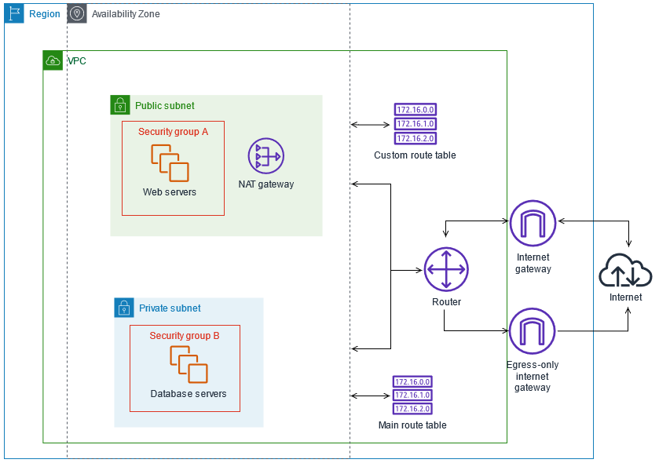

# module-vpc

This is an opinionated but very bare bones Terraform module to create a VPC which is based on the
sample architecture defined at https://docs.aws.amazon.com/vpc/latest/userguide/VPC_Scenario2.html

Specifically, what is built is roughly as below



A "public" and "private" subnet is created in each availability zone in the target region.

The "public" subnet has 80 and 443 open to everywhere, and SSH open to a nominated list of CIDR blocks. 80 and 443 is also allowed out to everywhere.

The "private" subnet allows 80 and 443 in from the "public" subnet, and 80/443 out to everywhere.

Note that the routing configured means that instances in the "public" subnet route directly through the internet gateweay, and if they have public IP addresses can be reached from the public internet. Instances in the "private" subnet route through the NAT gateway, and can reach the public internet, but no external source of traffic can initiate a connection.

Typical use cases would be to mount a load balancer or web service in the "public" subnet, and controlled data resources in the "private" subnet.

Note that this code also sets up sample Security Groups for private and public instances to make it easier to manage the intended design - see the example code for more details.

## Prerequisites
This module does make use of Terraform version constraints (see `versions.tf`) but can be summarised as:

 - Terraform 1.5.0 or above
 - Terraform AWS provider 5.4.0 or above

The example code broadly assumes AWS CLI 2.11.17 or better is available.

## Usage
See the `example` directory for more detailed information, however this is intended to be very simple to use, for example:

```
module test_vpc {
  source      = "github.com/TheBellman/module-vpc"

  tags        = { Owner = "Robert", Client = "Little Dog Digital", Project = "VPC Module Test" }
  vpc_cidr    = "172.21.0.0/16"
  vpc_name    = "test"
  ssh_inbound = ["89.36.68.26/32", "18.202.216.48/29", "3.8.37.24/29", "35.180.112.80/29"]
}
```

| Variable | Comment |
| :------- | :------ |
| tags | a map of strings to use as the common set of tags for all generated assets |
| vpc_cidr | the CIDR block for the VPC. The subnets are created by dividing this into 2 * number of AZ, and it is recommended that a /16 block be used |
| vpc_name | a name for the VPC that is used as a prefix on asset names and tags |
| ssh_inbound | a list of CIDR blocks which are permitted to SSH into public instances |

### Tags
A note on the tags you can provide - if your provider is configured to provide default tags (see the example), then the module will also "see" those tags. In other words, use this parameter for additional tags.

## License
Copyright 2022 Little Dog Digital

Licensed under the Apache License, Version 2.0 (the "License");
you may not use this file except in compliance with the License.
You may obtain a copy of the License at

  http://www.apache.org/licenses/LICENSE-2.0

Unless required by applicable law or agreed to in writing, software
distributed under the License is distributed on an "AS IS" BASIS,
WITHOUT WARRANTIES OR CONDITIONS OF ANY KIND, either express or implied.
See the License for the specific language governing permissions and
limitations under the License.
